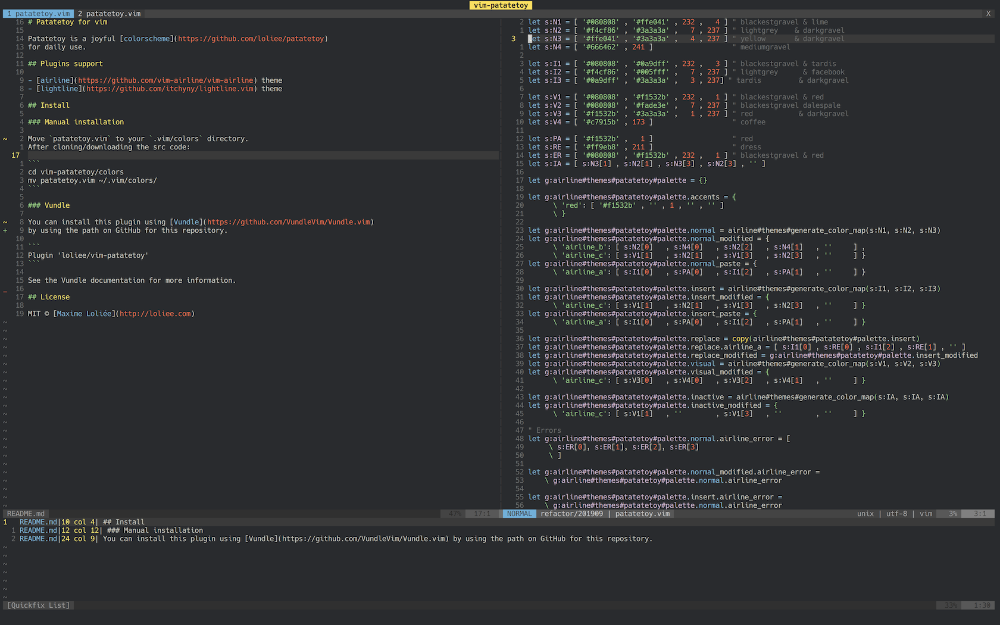

# Patatetoy for vim

Patatetoy is a joyful [colorscheme](https://github.com/loliee/patatetoy)
for daily use.



## Plugins

- [airline](https://github.com/vim-airline/vim-airline) support.
- [lightline](https://github.com/itchyny/lightline.vim) support.

## Install

### Manual installation

Move `patatetoy.vim` to your `.vim/colors` directory.
After cloning/downloading the src code:

```
cd vim-patatetoy/colors
mv patatetoy.vim ~/.vim/colors/
```

### Vundle

You can install this plugin using [Vundle](https://github.com/VundleVim/Vundle.vim)
by using the path on GitHub for this repository.

```
Plugin 'loliee/vim-patatetoy'
```

See the Vundle documentation for more information.

## License

MIT © [Maxime Loliée](http://loliee.com)
